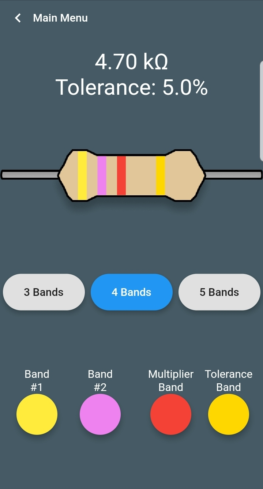
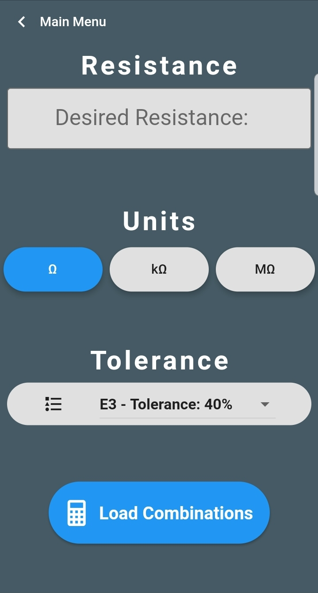
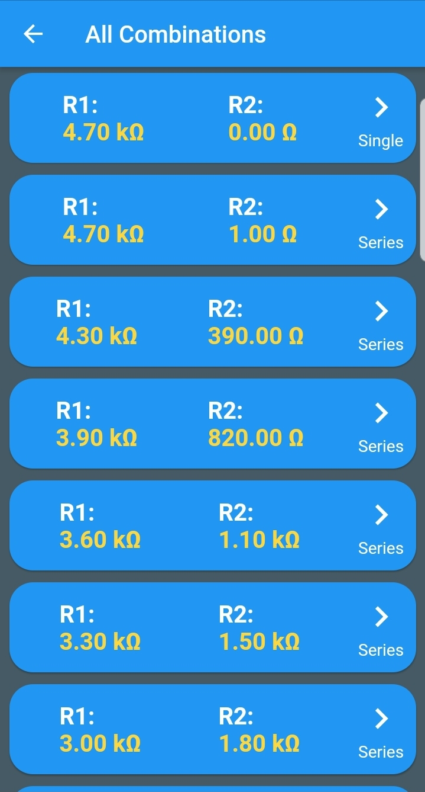
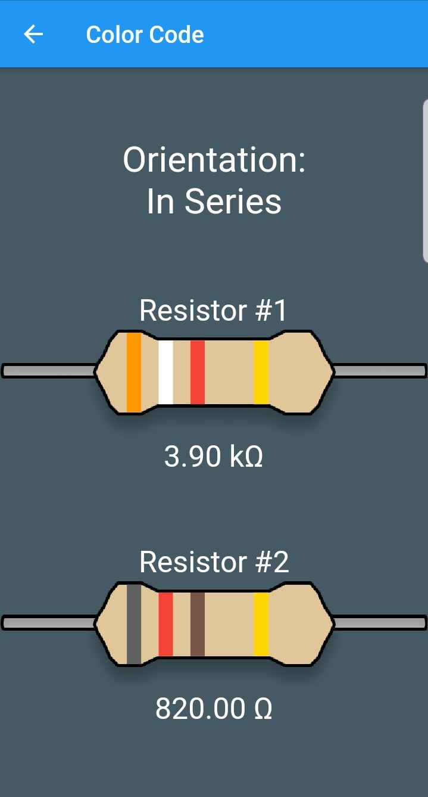

# ResistorGuide App

 ### An app that calculates resistor combinations and color codes.
 
 
 This app was created using the Flutter Framework in the Dart language
 
 Download it on the Google Play Store: 
 
 

 
 <table>
  <tr>
    <td>  </td>
    <td></td>
  </tr>
 </table>

# Demo:

  

# Functionality:

### Color Code to Resistance Calculator 

We've all ran in to those situations where you're in a lab and time is limited but you are stuck going through your lab kit, trying to figure out which resistor is which? 

Fortunately the first function of my app is a Color Code to Resistance Calculator.

Enter the number of bands and color of each band, The app will calculate the resistance and tolerance of the resistor and output it.

   

This was used as a reference for the calculations:

  

### Resistor Combinations and Color Code Calculator

One of the most important aspects when designing circuits is picking the right resistance for your needs. Unfortunately, most of the time after doing your calculations, you find that the resistance you need is not a standard value.

This app attempts to help with this issue by allowing the user to input any resistance they desire and tolerance details, the app will then calculate all the single, series and parallel combinations of 2 resistors in the standard set that will equal to the desired resistance (Within 2.5% Error).

The app displays these combinations in a list that when tapped, will show the color codes of both resistors.

    

  

The method of calculation for this function of the app was inspired by Claudio Girardi's Resistor Calculator found here:

https://www.qsl.net/in3otd/parallr.html

# Usage:

To edit and run this app, you will need a flutter compatible IDE.

First create a flutter project

Then replace these files with the ones in this github repo
* /lib
* /images
* /Sets
* /icons
* pubspec.yaml
* pubsec.lock

Then save and run and that is all you need to edit this code
